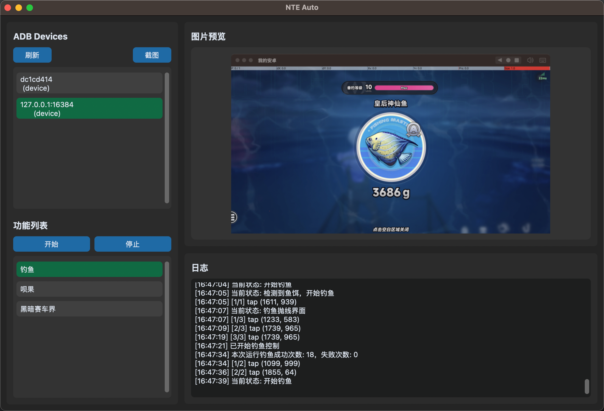

# 异环自动化

#### 支持以下内容：

- 钓鱼
- 呗果自动点赞评论
- 黑暗赛车界挂机

## 快速开始

### 安装模拟器和游戏

- 模拟器设置为1920*1080平板
- 确认模拟器已启动adb（如mumu模拟器为设备设置-开发者选项-ADB调试）

### 程序运行

#### windows ：

- release版本：[打开发布页](https://github.com/daydreary/nte_auto/releases)
- 源码使用：同mac

#### mac：

1. 安装python3.x环境
2. 下载zip包，解压
3. 终端切换到项目路径，执行pip install -r requirements.txt （仅首次）
4. 启动，执行python3 main.py

左侧选择对应模拟器，选择活动，点击开始即可

| 活动       | 说明                                                   |
| ---------- | ------------------------------------------------------ |
| 钓鱼       | 钓鱼准备页面启动（选择好鱼竿，鱼饵可以自动补充）       |
| 呗果       | 可在游戏主页面，活动列表，呗果活动页，呗果内容列表启动 |
| 黑暗赛车界 | 可在游戏主页面，活动列表，黑暗赛车页启动               |

   

## 免责声明

本工具仅供学习与技术研究使用。请遵守相关平台服务条款与法律法规，勿用于违规或滥用场景。使用本脚本产生的一切后果由使用者自行承担。
